# daedongmap-BackEnd

3팀 대동맛지도 프로젝트입니다. 
인스타 형식의 맛집 추천 웹사이트 서비스를 제작하려고 합니다.
사용자(리뷰어)가 직접 방문하고 식사한 식당의 리뷰를 인스타 게시물 형태로 공유할 수 있습니다.  
실제 인스타처럼 특정 리뷰어를 팔로우하고 해당 리뷰어가 리뷰한 맛집만을 골라서 지도 API를 통해 확인할 수 있습니다.  

## 팀원
- - -
### 백엔드
- 고상현: 사용자
- 유하진: 게시글, 댓글, 사진
- 이도길: 음식점, 음식점 카테고리

### 프론트엔드
- 안보란
- 윤수화
- 최종현

## 사용기술
- - -
### 프론트엔드
- , , , , , 
### 백엔드
- , , , , 

## ERD
- - -
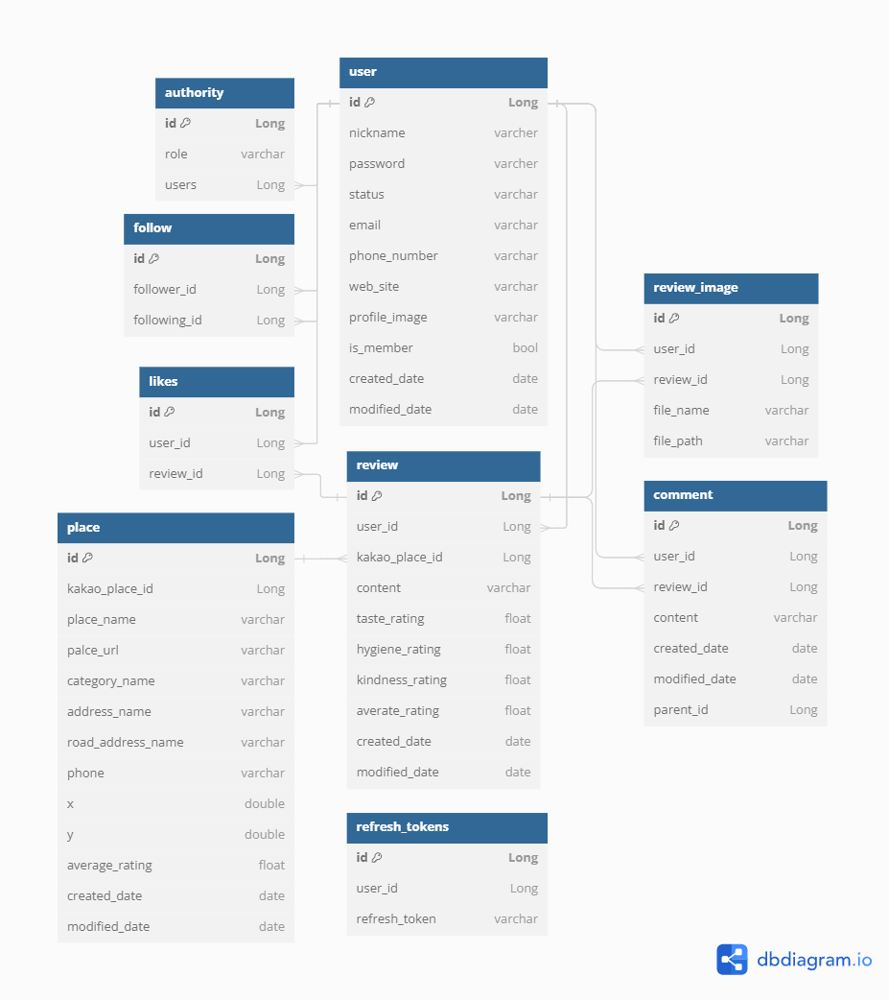

## 플로우차트
- - -

## 배포 아키텍쳐
- - -

## 와이어프레임
- - -
🔗[피그마 링크](https://www.figma.com/file/biEYWl2SSSEFUrQWyUKAy6/%ED%81%B4%EB%9D%BC%EC%9A%B0%EB%93%9C1%EA%B8%B0-%EC%B5%9C%EC%A2%85%ED%94%84%EB%A1%9C%EC%A0%9D%ED%8A%B8-%EB%A7%9B%EC%A7%91%EC%A7%80%EB%8F%84SNS---%EB%8C%80%EB%8F%99%EB%A7%9B%EC%A7%80%EB%8F%84?type=design&node-id=0-1&mode=design)

## 기능 명세
- - -

### 회원 
- 로그인/ 로그아웃 + OAuth
  - 로그인 시 jwt 접근 권한(access) 토큰, 리프레시(refresh) 토큰을 발급
  - 발급된 토큰 중 리프레시 토큰은 서버측에서 관리
  - 사용자는 토큰을 요청 헤더를 통해 전송하고 서버 측에서 인증과 인가
  - 로그 아웃 시 사용자 아이디를 통해 서버 측에 저장된 리프레시 토큰 삭제, 프론트단에서 엑세스 토큰 삭제
- 회원가입, 회원탈퇴, 아이디 찾기
  - 사용자는 사이트 자체 회원가입이나 구글, 카카오, 네이버 OAuth를 사용해 회원가입
    - 필요한 정보 작성 및 조건에 따른 회원가입 버튼 비활성화
  - 가입시 이메일 중복 확인을 하며 OAuth 사용자와 사이트 회원가입 사용자를 bool 값으로 구분

  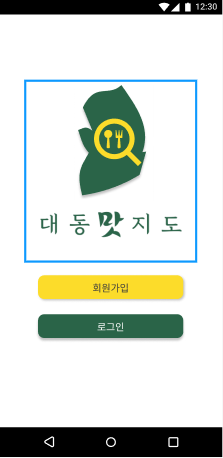
  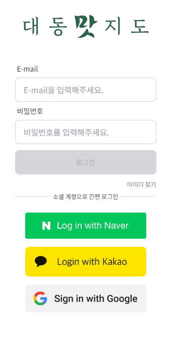

- 사용자 정보 조회 및 수정
  - 다른 사용자나 자신의 정보 조회 가능(마이페이지)
    - 사용자 정보 수정 (프로필 이미지, 닉네임, 상태메시지, 연동할 사이트)
  - 팔로우, 팔로잉
    - 자기 자신을 제외한 다른 유저 팔로우, 팔로잉

### 리뷰
- 리뷰 CRUD
  - 리뷰는 사진과 함께 등록
  - 리뷰에 댓글 CRUD
  

  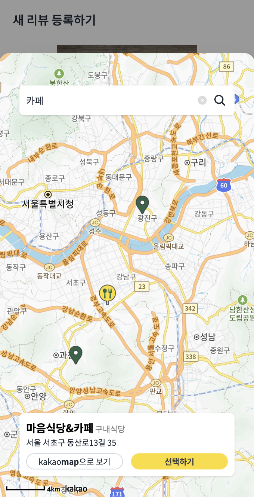
  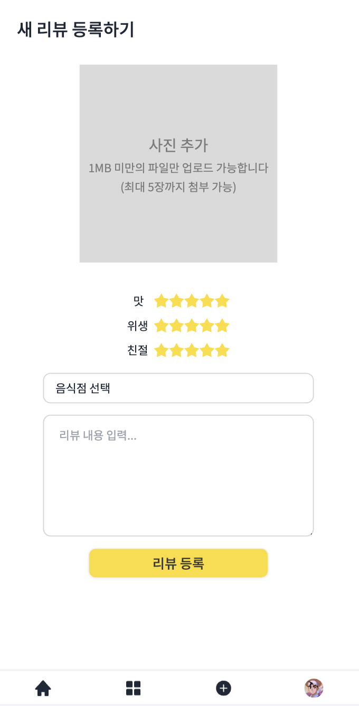
  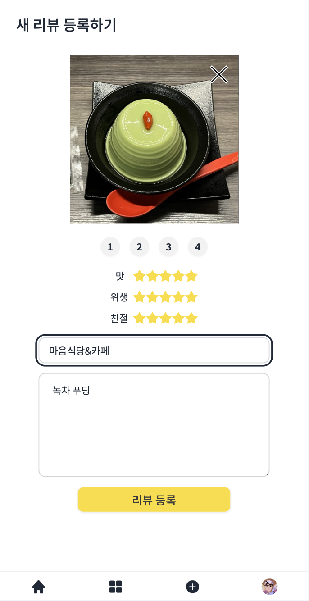
  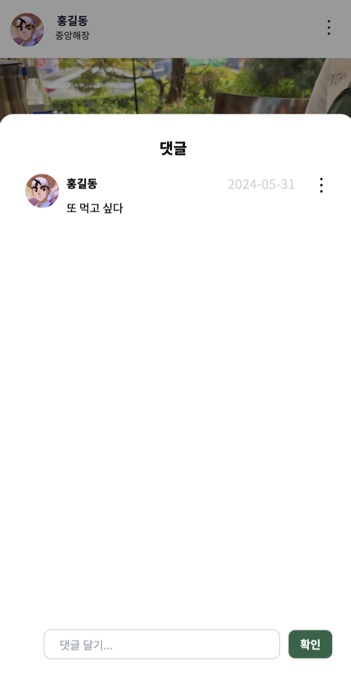

  - 팔로우/팔로워 기능
  - 리뷰 게시글에 좋아요 기능

  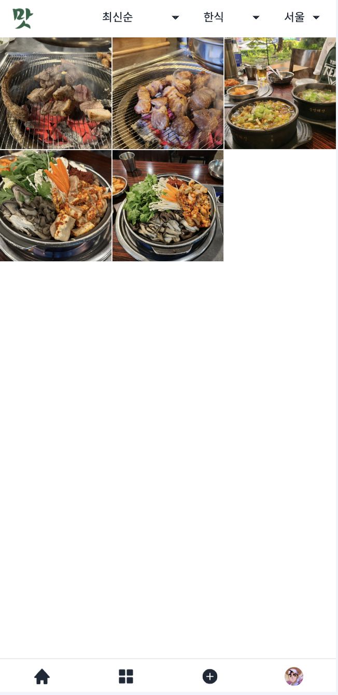
  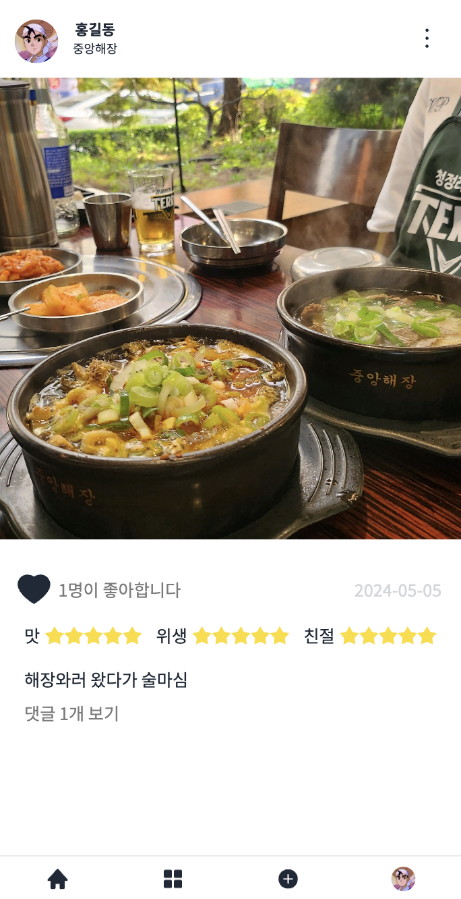

- 알림
  - 좋아요가 눌린 리뷰의 작성자와 팔로워가 생긴 사용자에게 실시간 알림
- 리뷰 목록 필터 기능

### 지도
  - 모든 사용자가 이용 가능
  - 검색
    - 검색창 - 지역 검색
    - 이 지역 검색하기 버튼 - 지도를 직접 이동하면서 원하는 위치에서 검색

  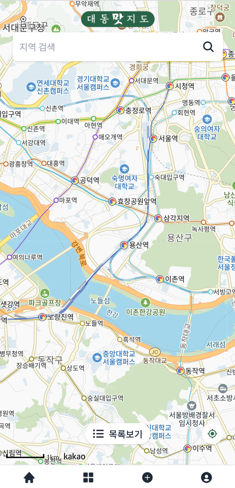
  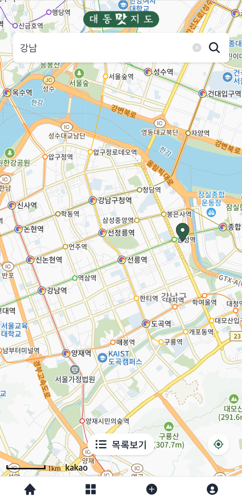
  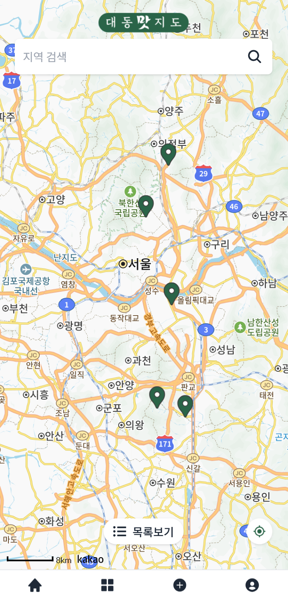

  - 음식점 목록
    - 목록보기 버튼 - 현재 표시되어 있는 음식점들의 목록 확인 가능
    - 필터링
      1. 추천순
      2. 별점순
      3. 거리순 - 위치 엑세스 허용 시
  - 음식점 정보
    - 마커 클릭 시 해당 음식점 정보 확인 가능
      - kakao map 버튼 - kakao map으로 이동
      - 음식점 정보 카드 - 음식점 리뷰 페이지 이동

  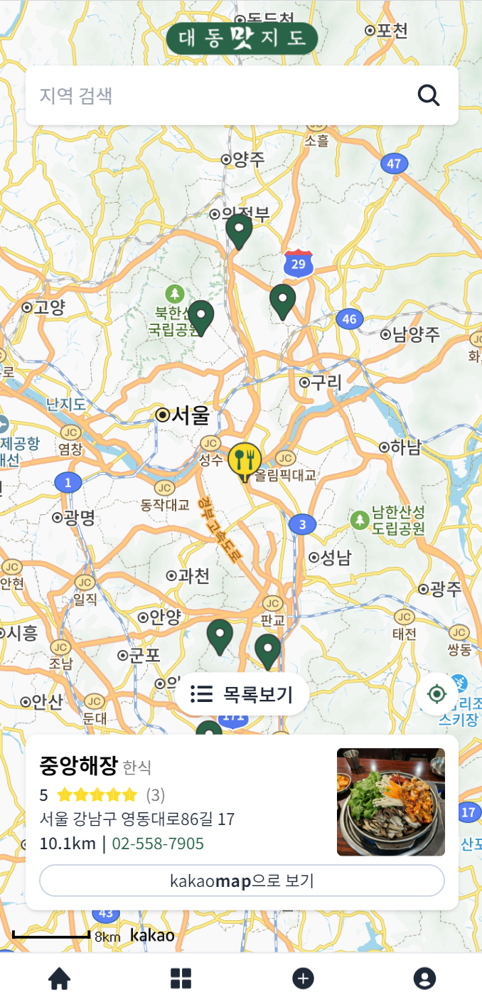
  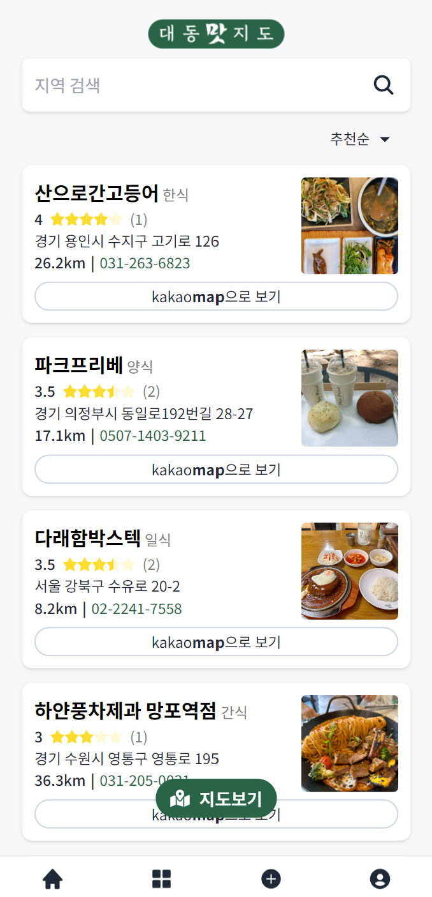
  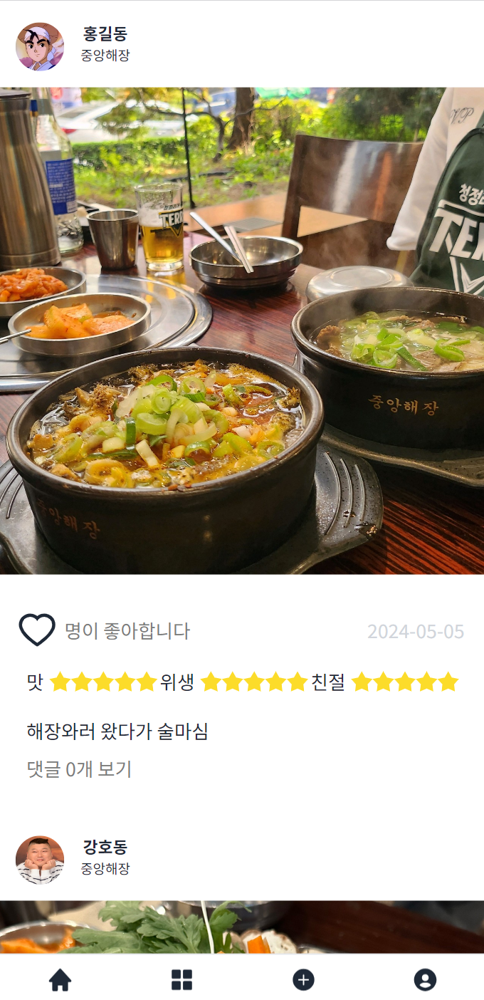

### 음식점
- 지역 검색
  - 검색한 지역에서 유저가 리뷰를 남긴 음식점들 조회
  - 지역의 위도, 경도 범위를 검색해서 해당하는 음식점들을 조회
    - 기본 랜덤, 평점, 거리순으로 필터링
- 음식점 검색
  - 음식점 CRUD
  - 카카오지도에서 받아온 음식점 정보 등록
    - 리뷰가 등록된 음식점 정보 상세 조회