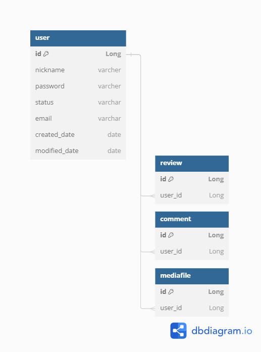
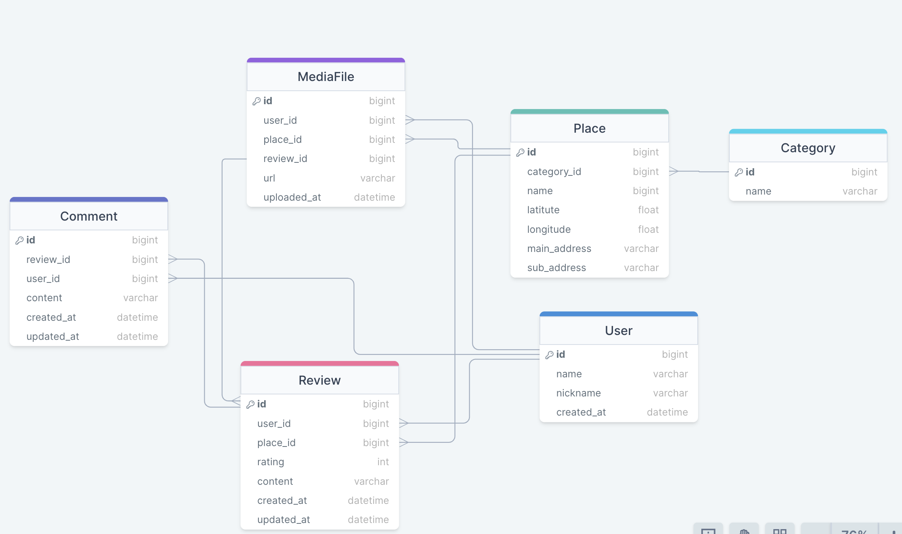
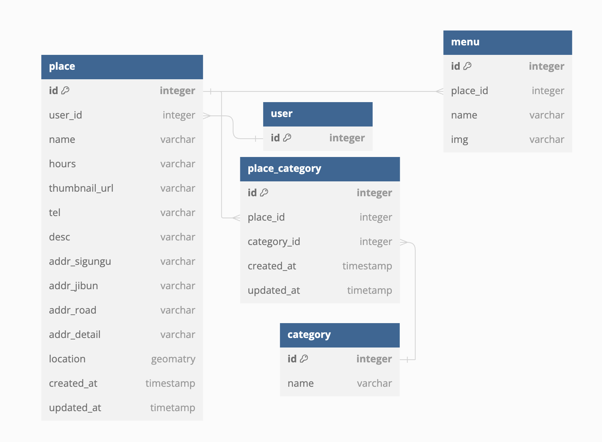

# daedongmap-BackEnd

3팀 대동맛지도 프로젝트입니다. 
인스타 형식의 맛집 추천 웹사이트 서비스를 제작하려고 합니다.
사용자(리뷰어)가 직접 방문하고 식사한 식당의 리뷰를 인스타 게시물 형태로 공유할 수 있습니다.  
실제 인스타처럼 특정 리뷰어를 팔로우하고 해당 리뷰어가 리뷰한 맛집만을 골라서 지도 API를 통해 확인할 수 있습니다.  

## 팀원
- - -
### 백엔드
- 고상현: 사용자
- 유하진: 게시글, 댓글, 사진
- 이도길: 음식점, 음식점 카테고리

### 프론트엔드
- 안보란
- 윤수화
- 최종현

## 사용기술
- - -
### 프론트엔드
- , , , , , 
### 백엔드
- , , , , 

## ERD
- - -
### 사용자

### 리뷰, 댓글, MediaFile

### 음식점, 분류

## 와이어프레임
- - -
🔗[피그마 링크](https://www.figma.com/file/biEYWl2SSSEFUrQWyUKAy6/%ED%81%B4%EB%9D%BC%EC%9A%B0%EB%93%9C1%EA%B8%B0-%EC%B5%9C%EC%A2%85%ED%94%84%EB%A1%9C%EC%A0%9D%ED%8A%B8-%EB%A7%9B%EC%A7%91%EC%A7%80%EB%8F%84SNS---%EB%8C%80%EB%8F%99%EB%A7%9B%EC%A7%80%EB%8F%84?type=design&node-id=0-1&mode=design)

## 기능 명세
- - -

세부 내역

- 회원
    - 로그인/ 로그아웃 + OAuth
    - 회원가입, 수정, 탈퇴
        - 이메일, 닉네임 중복 확인
    - jwt + refresh token
    -  뱃지, 등급 기능 (게시글, 팔로우가 많은 사람 등)
- 지도 연동 API
    - 핀 찍기
    - 자기 위치 자동 등록 기능
    - 위치 검색
    - 음식점 검색
    - 즐겨찾기 (음식점 바로가기, 팔로우 한 사람 게시글만 보기)
- 게시판 - 맛집 리뷰 등록
    - 쓰기, 수정, 삭제
    - 댓글 쓰기, 수정, 삭제
    - 처음 접속 시 현재 위치 기준으로 표시 (추천순, 리뷰순)
    - OR 빈 지도 보여주고 음식 종류별로 누르면 보여주기
    - 추천하기 비추천하기
    - 맛집 예약 기능
- 사진 업로드, 조회
    - 용량 문제 - 썸네일로 변환
- 검색 기능, 정렬
    - 사용자별로, 지역별로 자기 위치 중심으로
    - 추천순으로, 테마별로, 음식별로 정렬
    - 태그 검색
- 태그 기능
    - 음식별로, 지역별로, 혼밥, 분위기
    - 유저 등록 태그
    - 선호 태그 보여주기
- 음식 골라주는 기능
    - 선택지로 좁혀가는 기능 - 중식, 일식, 한식 월드컵
    - 음식 취향 분석 - 왓챠피디아 영화 분석 (달달한거, 짠거 등등으로 좁혀가는)

  

### 미결정 사안
- - -
카카오 API에서 어디까지 데이터를 제공하는지 아직 확실하지 않다

- 카카오 API에서 식당을 검색하여 식당이름, 위치 정보 데이터를 받아옴
    - 백에서 해당 정보를 저장하고
    - 공공데이터포털에 요청하여 일치하는 식당에 대한 세부 데이터를 받아옴
- 크롤링을 통한 데이터 수집
    - 크롤링으로 금전적 이익을 추구하거나 서버에 부하를 주지 않으면  문제가 없는 것으로 알고 있음